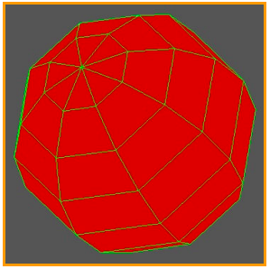
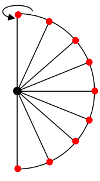
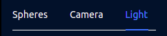
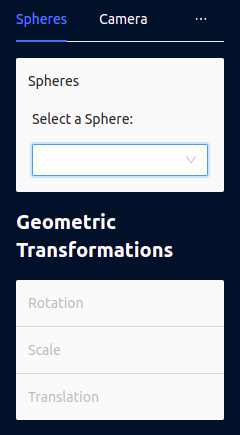
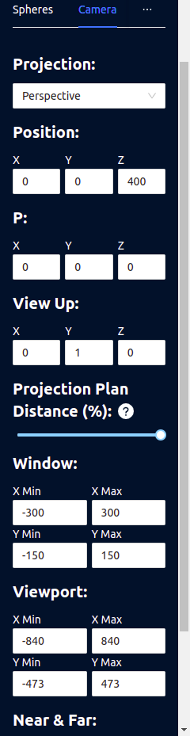
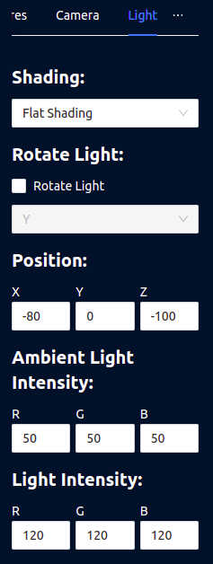

# SPHERE GENERATOR
> by Felipi Lima Matozinho & Pablo Hugen do Santos

App created for final work to the Computer Graphics discipline.
The app has the objective of implementing a generator of spheres, using its camera, lighting, and coordinates system.

Spheres are generated for a set of meridians and parallels, as shown in the image
<div align="center">
  
  
</div>

## Building
To build this application is needed the current LTS [NodeJs](https://nodejs.org/en/) Version (16.16 at the moment of the deployment) and a node package manager (npm or yarn).

After install the NodeJs, run the following commands:

### Using npm
```bash
  npm install #install all dependencies
```
```bash
  npm run build #Will build the application
```
```bash
  npm run serve #Will serve the app in a local port in your machine
```

### Using yarn
```bash
  yarn # install all dependencies
```
```bash
  yarn build # Will build the application
```
```bash
  yarn serve # Will serve the app in a local port in your machine
```

## Development Mode and Deployed Version
If you don't want to build the app, you can access it in [this link](https://sphere-3d-engine.vercel.app/).

If you want to play with the app, you can run it locally in development mode, run the following commands:

### Using npm
```bash
  npm install #install all dependencies
```
```bash
  npm run start #run app
```

### Using yarn
```bash
  yarn # install all dependencies
```
```bash
  yarn start # run app
```

## Usage
Is possible to configure all parameters of the camera, light, and spheres. 
Each of these configurations is accessible in a bar on the right sidebar.

<div align="center">
  
</div>


### Creating a new Sphere
In the bottom right side of the screen are two buttons, one to clean the scene and another to add a new Sphere. 
There are a fell default values if you don't know which to define.

<div align="center">
  
</div>

### Sphere actions
In the Sphere configurations section is possible to select a sphere in the scene (see by the sphere name).
After select one, is possible to apply any **Geometric Transformation**.

<div align="center">
  
</div>

### Camera actions
In the camera is possible to change all its params, but the **VRP** can be changes using **keybord actions**:

**W** - Increment **Y** coordinante <br/>
**S** - Decrement **Y** coordinante <br/>
**D** - Increment **X** coordinante <br/>
**A** - Decrement **X** coordinante <br/>
**E** - Increment **Z** coordinante <br/>
**Q** - Decrement **Z** coordinante <br/>

<div align="center">
  
</div>

### Light actions
Exists a **Global Light**, and a **point light**.
Exists a Global Light, and a point light. For Global Light, you can change its intensity and for the Point Light you can change its intensity and its position. In addition, it is possible to rotate the light around an axis. This rotation is done by 1 degree every frame.

<div align="center">
  
</div>

